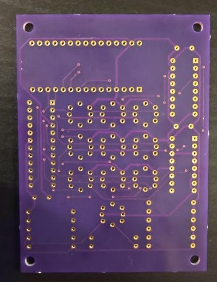

# Tic-Tac-Toe V1

This is a project to make a Tic-Tac-Toe game using Arduino Nano.

## PCB

 * The PCB has been designed with [KiCAD 6.0.10](https://www.kicad.org/).
 * The KiCAD project is available in [KiCAD/](KiCAD/) directory.

    
    
    
    

The pictures below show the PCB manufactured by [OSHPARK](https://oshpark.com/).

    
    
    

 
## Software

(TODO: explain how to install the software on the Arduino Nano.)

## Parts

The list below shows the parts that this project uses.

 * Arduino Nano
   * [Product webpage at Arduino.cc](https://docs.arduino.cc/hardware/nano)
   * [Datasheet](https://docs.arduino.cc/static/2d169cbfd360faf817882e36b9f69956/A000005-datasheet.pdf)
   * This project uses a compatible clone (Arduino Nano CH340).
 * Omron B3W-9000-RG2C: button with two LEDs (red and green)
   * [Product webpage at Omron](https://components.omron.com/eu-en/products/switches/B3W-9)
   * [Datasheet](https://components.omron.com/eu-en/datasheet_pdf/A167-E1.pdf)
   * [Product page at Mouser](https://www.mouser.com/ProductDetail/Omron-Electronics/B3W-9000-RG2C?qs=QTkYtwcxD6NNQk1oSF8osQ%3D%3D): includes the link to footprint.
   * [3D Model at SnapEDA](https://www.snapeda.com/parts/B3W-9000-RG2C/Omron%20Electronics/view-part/?ref=digikey)
 * Texas Instruments 74HC165: 8-bit parallel-load shift register
   * [Product webpage at Texas Instruments](https://www.ti.com/product/SN74HC165)
   * [Datasheet](https://www.ti.com/lit/ds/symlink/sn74hc165.pdf)
 * Analog Devices MAX7219: serially interfaced, LED display driver
   * [Product webpage at Analog Devices](https://www.analog.com/en/products/max7219.html)
   * [Datasheet](https://www.analog.com/media/en/technical-documentation/data-sheets/MAX7219-MAX7221.pdf)
   * [LedControl - An Arduino library for the MAX7219 and MAX7221](http://wayoda.github.io/LedControl/index.html)
     * This program uses this library to control MAX7219.
     * The page above also explains how to wire up LEDs to MAX7219.
